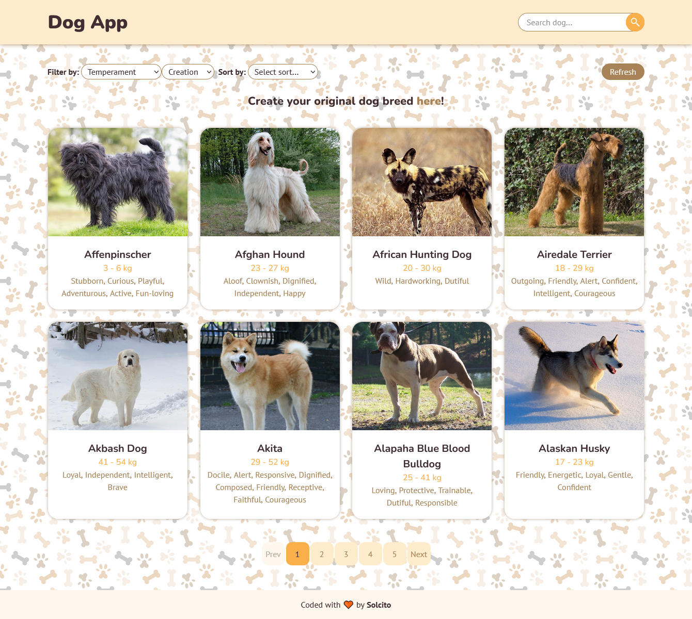
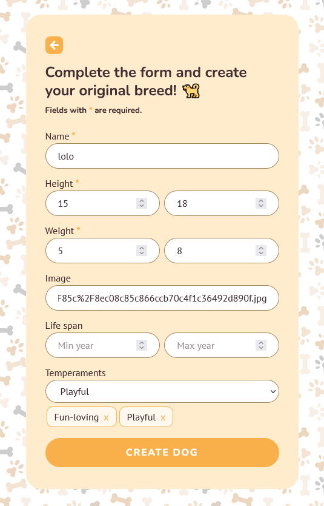
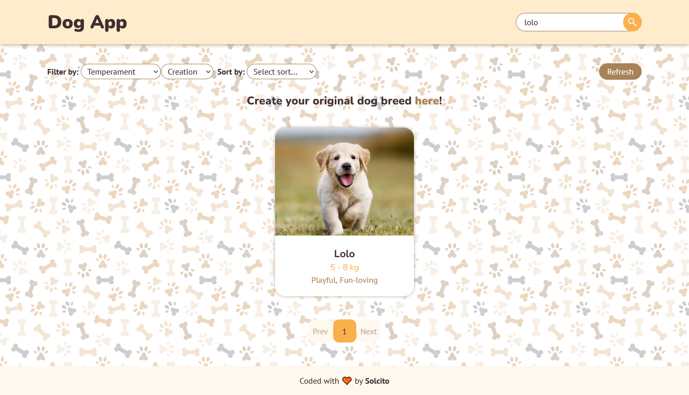
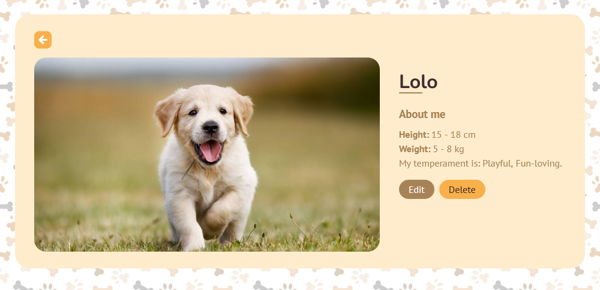
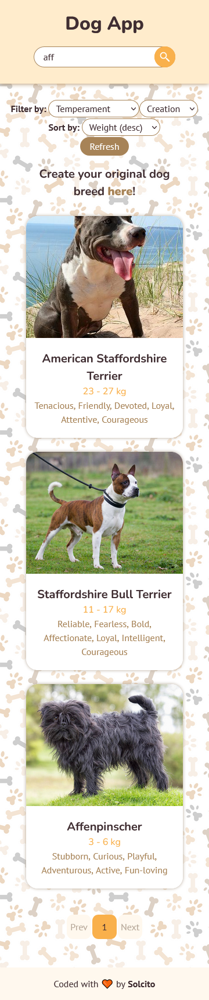

# Individual Project - Henry Dogs

## Objetivos
- Construir una App utlizando React, Redux, Node y Sequelize.
- Afirmar y conectar los conceptos aprendidos en la carrera.
- Aprender mejores prácticas.
- Aprender y practicar el workflow de GIT.
- Usar y practicar testing.

## Proyecto
El proyecto es una aplicación Full Stack en la cual se puede visualizar alrededor de 170 razas de perros. La aplicación le permite al usuario filtrar por raza, temperamento y realizar diversos ordenamientos. Además, puede buscar por nombre, crear una raza nueva y editar o borrar una ya existente.
Esta aplicación fue desarrollada como proyecto individual en el Bootcamp de soyHenry.

## Tecnologías
El FrontEnd de la aplicación se encuentra desarrollado con React.js, Redux y CSS.

El BackEnd se encuentra desarrollado con NodeJS, Express y PostgreSQL.

## Funciones
- Visualizar +170 razas de perros.
- Acceder a los detalles de cada uno.
- Buscar, filtrar y ordenar las razas.
- Visualizar por página.
- Crear una nueva Raza.
- Editar la raza creada.
- Eliminar la raza creada.

## Screenshots

<!-- 

 -->
